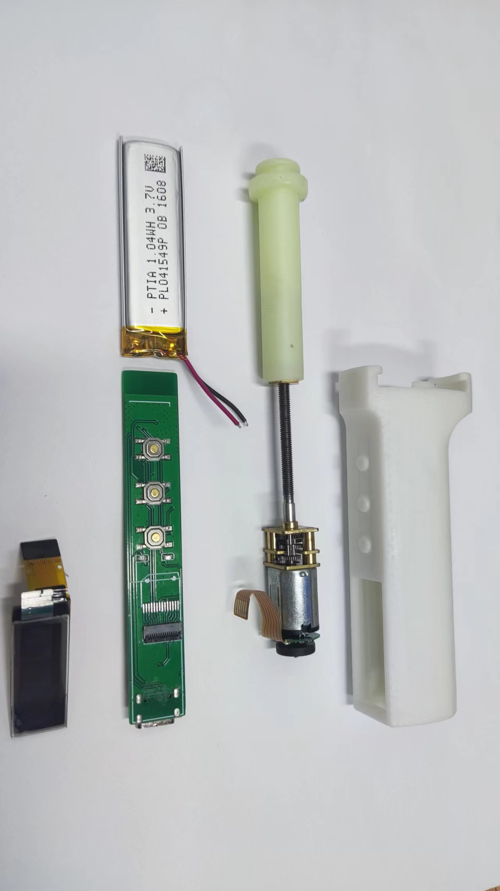
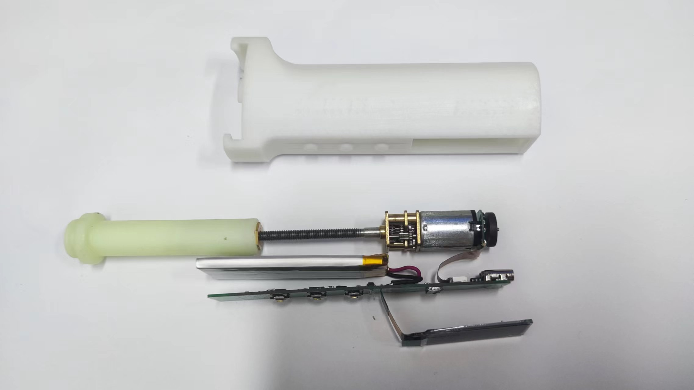
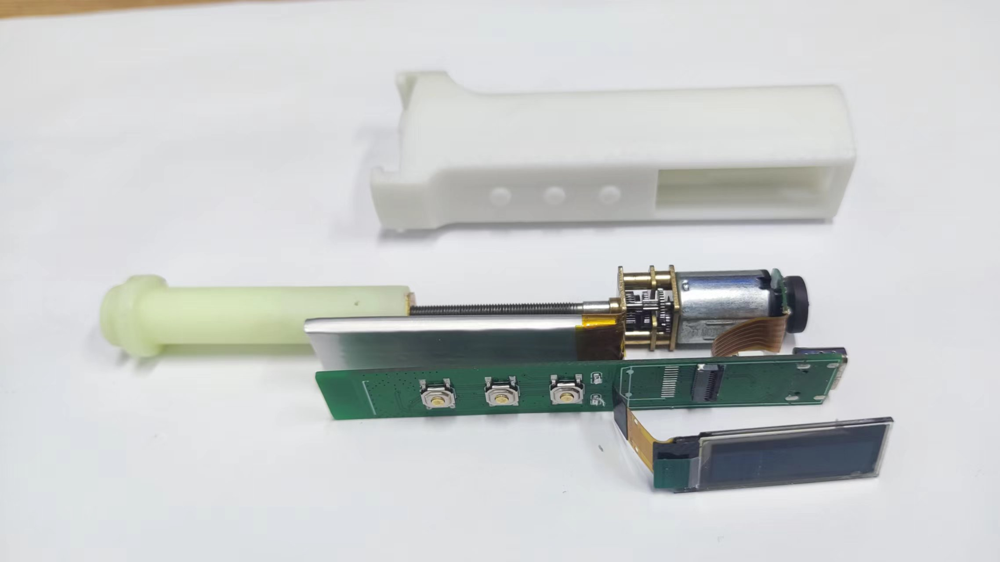
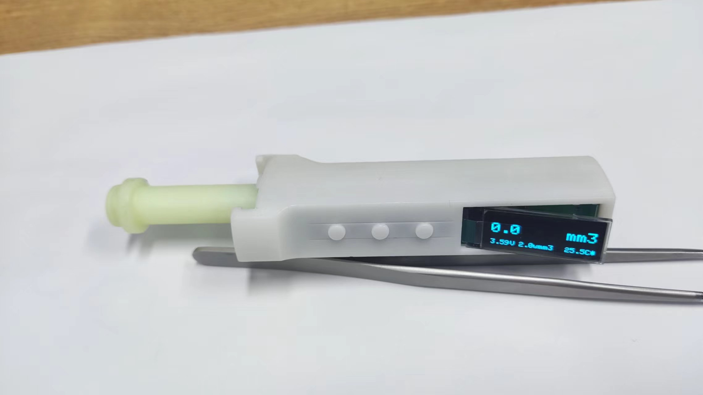
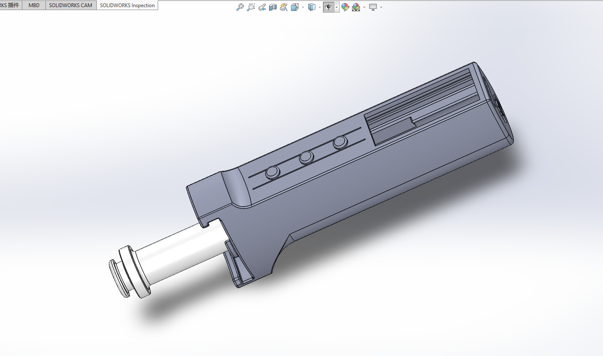
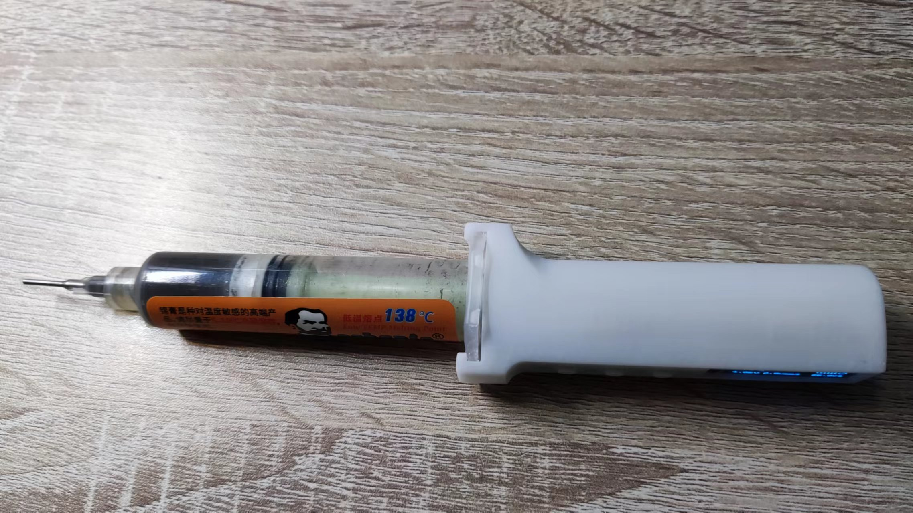

# 智能点锡笔

#### 智能点锡笔 基于ESP32 C3芯片N20减速电机驱动推杆实现自动挤出吸入等功能  通过MCU6050检测运动姿态和采集N20电机上霍尔编码器转动信号实现智能控制和挤出吸入定量控制 并通过0.91寸OLED屏显示各种参数 支持TYPE-C直接下载烧录程序和为锂电池充电等功能    
1.  TYPE-C支持USB通信和一键程序下载烧录程序 
2.  TYPE-C支持为锂电池充电 最大功率：5V 0.23A左右
3.  带霍尔N20减速电机我使用的是淘宝购买的：精密电子锁电机 B款 正牙 螺距0.35 减速比1:240  DC3.4V 81转 带螺母
4.  锂电池我使用的是401550 3.7V 300mAh 其他尺寸：401545/401540都行容量越大越好
5.  显示屏用SSD1306 0.91寸 14P引脚 IIC协议 支持使用普通焊接式和FPC插接式接口的OLED
6.  3个微动按键进行参数设置和功能切换  一个触摸感应开关控制开关机
7.  触摸感应开关通过复用TYPE-C接口作为触摸感应电极节省空间进行开关机控制 关机时锂电池待机电流<8uA
8.  支持NTC测温和锂电池电压测量
9.  因外壳设计仅支持10CC点胶针筒装容器 目前主要完美支持安立信50g装针筒锡膏容器

#### 基础功能模式
1. 主要功能模式：自动模式  手动模式  定量模式 设置保存模式 通过长按左键和点按切换 
2. 自动模式：自动检测仪器运动姿态控制电机挤出吸入 由于不会姿态算法电机控制有点卡顿 
3. 手动模式: 通过中键和右键手动控制电机控制挤出吸入
4. 定量模式：通过中键和右键手动设定要挤出吸入的量 在进入模式执行后清零
5. 设置保存模式：保存设置参数 自动挤出容量 自动回抽容量  电机转速控制 屏显方向 通过中键和右键设定和控制

#### 程序下载
1. 程序基于Arduino IDE 开发 需要安装好相关库接好数据线  选择ESP32 C3 和对应串口编译上传即可 相关选项在程序头部注释内
2. Arduino IDE 没有安装过ESP32 C3开发板的需要自行安装 安装教程自行百度 
3. 编译报错检查有没有安装好相关依赖库 上传出错检查下接线和是否处在下载模式 
4. 程序和功能都不是很完善 等以后有空可能会升级下  程序和依赖库在附件内
 
#### 注意事项
1. PCB 打样2层板 板厚0.8mm  长90mm 宽49mm  元件参数以原理图为准 嘉立创没有或特贵的元件建议上淘宝 相关软硬件资料都在附件内
2. 智能点锡笔主要由主控PCBA + 锂电池 + 0.91 OLED + N20减速电机 + 3D打印的外壳 + 3D打印的推杆组成
3. 外壳和推杆我在 嘉立创3维猴生产的  相关3D打印生产文件在附件内 安装时电机需要用M2螺丝通过外壳上的定位孔进行卡住以免意外拔出
4. 第一次使用需要配置下相关参数 容器横截面积默认选择10CC点胶针筒 电机参数要与软件设定参数相符 
5. 因为电机驱动不是太精准导致挤出吸入容量不够精准 运动姿态检测程序也有一定问题 介意勿用 
6. 此项目软硬件都比较复杂 适合有一定DIY基础的人复刻

#### 其他平台
1. 立创开源平台：https://oshwhub.com/fj956391150/zhi-neng-dian-xi-bi
2. 图片演示

